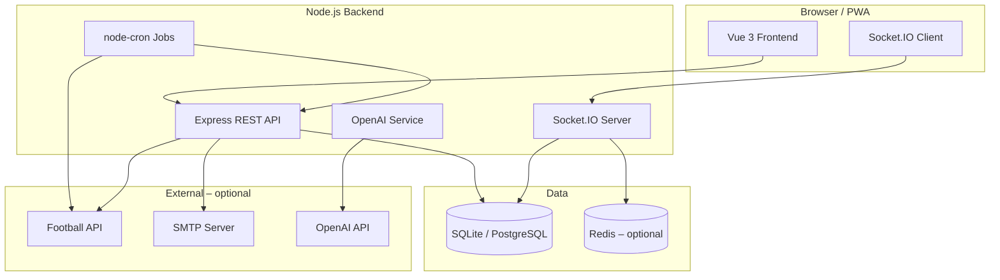

<p align="center">
  
</p>

<h1 align="center">WM 2026 Prediction Game</h1>

<p align="center">
  Football prediction web app for company teams — live scores, bonus questions, team rankings, AI coach &amp; full admin panel
</p>

<p align="center">
  <a href="https://github.com/schmeckm/aspire-make-tippspiel/actions/workflows/ci.yml"></a>
  <a href="https://github.com/schmeckm/aspire-make-tippspiel/actions/workflows/docker-publish.yml"></a>
  
  
  
  
</p>

<p align="center">
  <a href="#quick-start">Quick Start</a> ·
  <a href="docs/DEPLOY-GITHUB-PORTAINER.md">Deployment</a> ·
  <a href="docs/GITHUB-SETUP.md">GitHub Setup</a> ·
  <a href="CHANGELOG.md">Changelog</a> ·
  <a href="https://github.com/schmeckm/aspire-make-tippspiel">GitHub</a>
</p>

---

## Table of Contents

- [Screenshots](#screenshots)
- [Overview](#overview)
- [Features](#features)
- [Scoring Rules](#scoring-rules)
- [Tech Stack](#tech-stack)
- [Quick Start](#quick-start)
- [Configuration](#configuration)
- [Deployment](#deployment)
- [Architecture](#architecture)
- [API Overview](#api-overview)
- [Troubleshooting](#troubleshooting)
- [License](#license)

---

## Screenshots

> Add screenshots under `docs/images/` and link them here. See [docs/images/README.md](docs/images/README.md).

<p align="center">
  
  
</p>

<p align="center">
  
  
</p>

---

## Overview

This prediction game is built for **internal company teams** (e.g. IT, Finance, HR). Each participant independently predicts all **104 World Cup matches** (72 group stage + 32 knockout games). Points, leaderboard, and team rankings are calculated **deterministically in the backend** — optionally complemented by AI helpers that do not produce official results.

| | |
|---|---|
| **Frontend** | Vue 3 SPA, PWA-ready, 4 languages (DE/EN/FR/ES) |
| **Backend** | Node.js REST API + WebSocket |
| **Database** | SQLite (dev) / PostgreSQL (prod) |
| **Operations** | Manual (CSV) or automatic (Football API) |

---

## Features

### For Players

| Feature | Description |
|---------|-------------|
| **Dashboard** | Personal overview: upcoming matches, open predictions, rank, AI insights |
| **Matches** | All 104 World Cup games with filters (open, finished, missing picks), kickoff countdown |
| **My Predictions** | Compact overview of all submitted forecasts |
| **Group Standings** | Live tables for groups A–L with projections |
| **Knockout Bracket** | Bracket with zoom, list view, and match linking |
| **National Teams** | Squads, tables, scorers, live matches, World Cup head-to-head history |
| **Bonus Questions** | Special bets (champion, runner-up, third place, top scorer, team progress) |
| **Leaderboard** | Rankings with filters (overall, matches, bonus, group, knockout), CSV export |
| **Team Ranking** | Department ranking by **average points per member** (not total sum) |
| **Statistics** | Personal performance with Chart.js diagrams |
| **Prizes** | Visible prizes for places 1–3 (enabled by admin) |
| **Profile** | Avatar, favorite team, top scorer pick, language, dark mode, optional 2FA |
| **Rules** | Official guidelines at `/help` |
| **AI Coach** | Chat about strategy, missing predictions, and points |
| **Notifications** | In-app messages with live updates via WebSocket |
| **PWA** | Installable on smartphone/tablet |

### Authentication & Profile

- Email/password registration with verification
- **Google SSO** (optional, via `GOOGLE_CLIENT_ID` / `GOOGLE_CLIENT_SECRET`)
- Password reset via email
- **Two-factor authentication** (TOTP) in profile
- Reminder for incomplete profile (favorite team + top scorer)

### Public Display Mode

For projector/TV without login:

| Route | Content |
|-------|---------|
| `/display` | Leaderboard & highlights |
| `/display/bracket` | Knockout bracket |

Enabled and access-controlled via admin settings (`displayModeEnabled`).

### AI Features (optional)

> **AI is not a source of truth.** It does not calculate points, invent results, or change predictions.

| Feature | Audience | Description |
|---------|----------|-------------|
| Match preview | Players | Neutral opinion per match |
| AI coach | Players | Chat about predictions, rank, and strategy |
| Leaderboard commentary | Players | Short summary of rank movements |
| Dashboard insights | Players | Personalized hint cards |
| Admin assistant | Admin | Diagnostics, recommendations, copy |
| Bonus suggestions | Admin | Suggestions for new bonus questions |
| Reminder copy | Admin | Email and in-app reminder text |

Enable via `OPENAI_API_KEY` in `backend/.env`. Individual features can be disabled separately.

### Admin Panel

| Area | Functions |
|------|-----------|
| **Dashboard** | System overview, quick actions, AI insights |
| **Users** | Create, roles, lock, admin rights |
| **Teams** | Manage departments |
| **Matches** | Edit schedule, lock, correct |
| **Results** | Manual result entry |
| **Predictions** | View and manage all forecasts |
| **Import** | CSV schedule import |
| **Sync** | Football API: fixtures, results, live scores, player images |
| **Bonus Questions** | Create, resolve, apply tournament suggestions |
| **Scoring Rules** | Exact / goal difference / tendency configurable |
| **Prizes** | Define and publish places 1–3 |
| **Email** | SMTP reminders for missing predictions |
| **Notifications** | In-app messages to all or individual users |
| **Statistics** | Overview, completeness, missing predictions |
| **Favorites** | Users' favorite teams and top scorers |
| **Player Images** | Sync via TheSportsDB / Wikimedia |
| **Backup** | JSON export/import, **Excel emergency export** (leaderboard, predictions, bonus, matches) |
| **Audit Log** | Log of all admin actions |
| **System** | Settings, display mode, app title |
| **AI Assistant** | Admin AI with interaction log |

### Automation

| Job | Schedule | Description |
|-----|----------|-------------|
| Fixture sync | Daily 06:00 | Update fixed schedules |
| Fixture sync (tournament) | Every 6 hours | During World Cup period |
| Result sync | Every 15 minutes | During World Cup period |
| Live sync | Every 5 minutes | Only during live matches |
| Email reminders | Daily 09:00 | Missing predictions & bonus questions |
| Leaderboard snapshot | Hourly | Save rank history |

---

## Scoring Rules

### Points per Match

After full time, only the **best matching category** counts:

| Outcome | Points (default) |
|---------|------------------|
| Exact score | 4 |
| Correct goal difference (when predicting a win) | 3 |
| Correct tendency (win/draw) | 2 |
| Wrong prediction | 0 |

### Bonus Questions (default)

| Question | Points |
|----------|--------|
| World champion | 8 |
| Runner-up | 4 |
| Third place | 2 |
| Top scorer | 4 |
| How far does your favorite team go? | 2 |

### Team Ranking

Each department is rated by **average points per registered member** — the largest department does not automatically win.

### Prediction Requirement

Technically, not all matches are mandatory (missing predictions = 0 points). **House rule:** Every participant predicts all 104 matches themselves.

Full rules are available in the app under **Rules** (`/help`).

---

## Tech Stack

| Area | Technologies |
|------|--------------|
| **Frontend** | Vue 3, Vite, Pinia, Vue Router, Vue I18n, Axios, Chart.js, Socket.IO Client, PWA |
| **Backend** | Node.js, Express, Sequelize, Socket.IO, node-cron, nodemailer, OpenAI, ExcelJS |
| **Database** | SQLite (development) / PostgreSQL (production) |
| **Auth** | JWT, bcrypt, Google OIDC, TOTP (speakeasy) |
| **Monitoring** | Sentry (optional), Prometheus metrics |
| **CI/CD** | GitHub Actions (Docker build) |

---

## Quick Start

### Prerequisites

- Node.js 20+
- npm

### Backend

```bash
cd backend
npm install
cp .env.example .env
npm run seed
npm run dev
```

### Frontend

```bash
cd frontend
npm install
npm run dev
```

| Service | URL |
|---------|-----|
| Frontend | http://localhost:5173 |
| Backend | http://localhost:3000 |
| Health | http://localhost:3000/api/health |

### Demo Accounts (after `npm run seed`)

| Role | Email | Password |
|------|-------|----------|
| Admin | admin@example.com | admin123 |
| User | max.mueller@example.com | user123 |

### Database Commands

```bash
cd backend
npm run db:migrate          # Apply schema changes (no data loss)
npm run db:seed-teams       # Default company teams
npm run db:reset -- --confirm   # Full reset (dev only!)
npm run seed                # Demo data (empty DB only)
```

---

## Configuration

All variables with comments: [`backend/.env.example`](backend/.env.example)

### Key Settings

```env
# Core
PORT=3000
JWT_SECRET=your-secret-key
APP_URL=http://localhost:5173

# Database
DB_DIALECT=sqlite
DB_PATH=./database/wm2026.sqlite
# Production: DB_DIALECT=postgres + DB_HOST, DB_NAME, DB_USER, DB_PASSWORD

# Football API (optional — without key: CSV/manual mode)
FOOTBALL_API_PROVIDER=football-data
FOOTBALL_API_KEY=
FOOTBALL_API_SYNC_ENABLED=false

# Email (optional — without SMTP: mock mode in console)
SMTP_HOST=
SMTP_PORT=587
SMTP_USER=
SMTP_PASSWORD=

# AI (optional)
OPENAI_API_KEY=
AI_FEATURES_ENABLED=true

# Google SSO (optional)
GOOGLE_CLIENT_ID=
GOOGLE_CLIENT_SECRET=
GOOGLE_CALLBACK_URL=http://localhost:3000/api/auth/google/callback
```

### Football API

**Default:** CSV import + manual results — the app works **fully without an API key**.

| Provider | `FOOTBALL_API_PROVIDER` | Recommendation |
|----------|-------------------------|----------------|
| football-data.org v4 | `football-data` | **Recommended** |
| API-Football | `api-football` | Alternative |
| Sportmonks | `sportmonks` | Alternative |
| TheStatsAPI | `thestatsapi` | Alternative |

The frontend **never** calls external APIs directly. Admin sync is at `/admin/sync`.

**Overwrite protection:**

- `isManuallyLocked = true` → API will not overwrite
- `isApiManaged = false` → match skipped during sync
- All sync operations logged in `SyncLog`

### AI Cost Control

| Measure | Description |
|---------|-------------|
| Caching | Previews and commentary in `AICommentary` |
| Token limit | `AI_MAX_TOKENS=800` |
| Rate limits | Coach: 20/day, Admin: 50/day, Bonus: 20/day |
| Model | `gpt-4o-mini` (default) |

---

## Deployment

### Docker (local)

```bash
# SQLite
docker compose up --build
docker compose exec backend node database/seed.js

# PostgreSQL
docker compose --profile postgres up --build
```

### Production (GitHub + Portainer)

Full guide: [**docs/DEPLOY-GITHUB-PORTAINER.md**](docs/DEPLOY-GITHUB-PORTAINER.md)

```bash
git clone https://github.com/schmeckm/aspire-make-tippspiel.git
# Deploy stack in Portainer with docker-compose.prod.yml
```

**Google SSO in production:** Do not use raw IPs — use e.g. an `sslip.io` hostname for `APP_URL`, `CORS_ORIGIN`, and `GOOGLE_CALLBACK_URL`.

---

## Architecture



---

## API Overview

Full endpoints are in route files under `backend/routes/`.

### Core (Players)

```
GET  /api/matches
POST /api/predictions
GET  /api/leaderboard
GET  /api/leaderboard/export
GET  /api/bonus-questions
GET  /api/scoring-rules
GET  /api/statistics/me
```

### AI (Players)

```
GET  /api/ai/status
POST /api/ai/match-preview/:matchId
POST /api/ai/user-coach
GET  /api/ai/leaderboard-summary
GET  /api/ai/dashboard-insights
```

### Admin (selection)

```
POST /api/admin/sync/fixtures
POST /api/admin/sync/results
POST /api/admin/bonus-questions/:id/resolve
GET  /api/admin/audit-log
POST /api/admin/backup/export-excel
POST /api/admin/ai/assistant
```

### Display (public)

```
GET  /api/display/leaderboard
GET  /api/display/bracket
```

---

## Troubleshooting

| Problem | Solution |
|---------|----------|
| API sync fails | Check `FOOTBALL_API_KEY` and provider, test connection at `/admin/sync` |
| No emails | Configure SMTP in `.env` or check mock log in console |
| WebSocket won't connect | Restart backend, check `VITE_SOCKET_URL` / proxy |
| DB schema outdated | Run `npm run db:migrate` or restart backend with migration |
| Port 3000 in use | Set `PORT=3001` in `.env` |
| AI not responding | Check `OPENAI_API_KEY`, set `AI_FEATURES_ENABLED=true` |
| Google SSO error | Callback URL and `APP_URL` must exactly match the domain |
| Player image sync stuck | Resume sync in admin; stale jobs are detected after timeout |

---

## License

Proprietary software — for private/internal use only. See [LICENSE](LICENSE).

---

<p align="center">
  <sub>WM 2026 Prediction Game · Version 1.0.5</sub><br />
  <a href="https://github.com/schmeckm/aspire-make-tippspiel">GitHub Repository</a> ·
  <a href="CONTRIBUTING.md">Contributing</a> ·
  <a href="SECURITY.md">Security</a>
</p>
