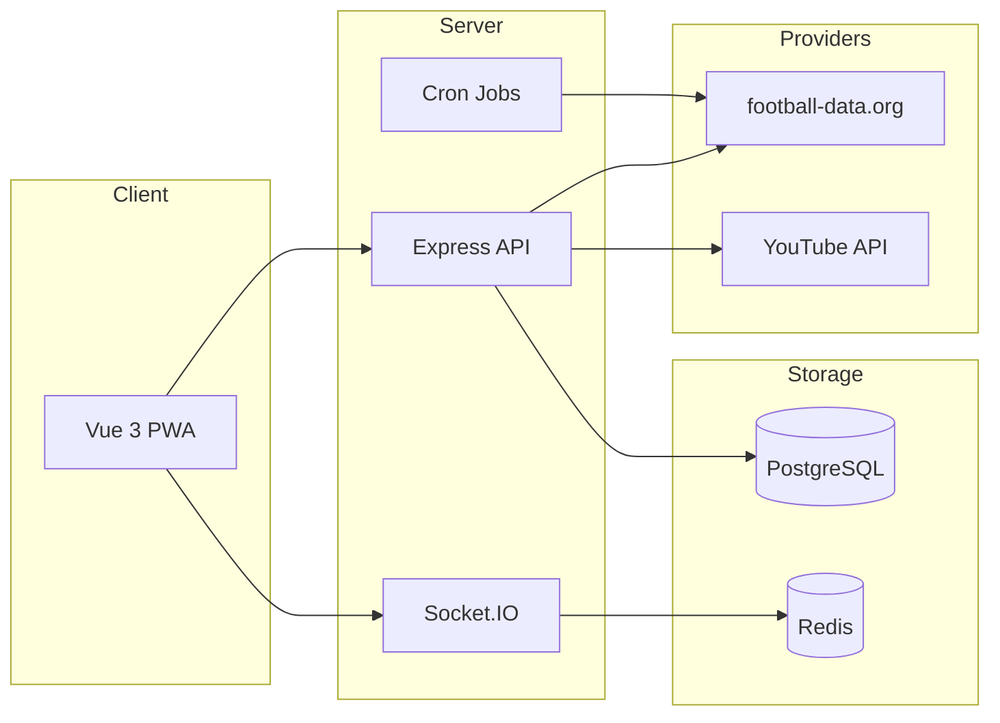

<p align="center">
  
</p>

<h1 align="center">WM 2026 Prediction Game</h1>

<p align="center">
  <strong>Enterprise-ready World Cup tipping portal</strong><br />
  Live scores · team rankings · bonus questions · AI coach · full admin suite
</p>

<p align="center">
  <a href="https://github.com/schmeckm/WM2026_Prediction/actions/workflows/ci.yml"></a>
  <a href="https://github.com/schmeckm/WM2026_Prediction/actions/workflows/docker-publish.yml"></a>
  
  
  
  <a href="LICENSE"></a>
</p>

<p align="center">
  <a href="#quick-start">Quick Start</a> ·
  <a href="#match-data--external-apis">Match Data</a> ·
  <a href="#deployment">Deployment</a> ·
  <a href="docs/DEPLOY-GITHUB-PORTAINER.md">Portainer Guide</a> ·
  <a href="CHANGELOG.md">Changelog</a> ·
  <a href="LICENSE">License (MIT)</a>
</p>

---

## About

**WM 2026 Prediction Game** is a full-stack web application for company-wide World Cup tipping. Departments compete fairly by **average points per member**. All scoring is computed **deterministically in the backend** — AI features are optional helpers only and never change official results.

Built for internal teams (IT, Finance, HR, …) with **104 matches** (72 group stage + 32 knockout), multilingual UI, PWA support, and production deployment via Docker / Portainer.

| Layer | Stack |
|-------|--------|
| **Frontend** | Vue 3 · Vite · Pinia · PWA · 7 languages (DE / EN / FR / ES / PT / PL / TR) |
| **Backend** | Node.js · Express · Sequelize · Socket.IO · node-cron |
| **Data** | SQLite (dev) · PostgreSQL + Redis (production) |
| **Delivery** | GitHub Actions → GHCR images · `docker-compose.prod.yml` |

---

## Highlights

| | | |
|:---:|:---:|:---:|
| **Live tournament data** | **Fair team ranking** | **Operations-ready** |
| Fixtures, results & live scores synced from a football data provider (server-side only) | Departments ranked by avg. points — not raw totals | Admin panel, audit log, backups, Excel export, cron jobs |
| **AI coach** (optional) | **Display mode** for TV | **Feedback → GitHub** |
| Strategy chat, previews, insights — never alters scores | Public leaderboard & bracket routes | Users report gaps; admins promote to GitHub Issues |

---

## Match Data & External APIs

> The **backend** fetches tournament data from external providers. The **browser never calls football APIs directly** — all sync runs server-side.

### Football results & fixtures (primary)

For automatic match schedules, live scores, and final results, the backend uses a configurable **football data provider**. Recommended default:

| Setting | Value |
|---------|--------|
| Provider | [football-data.org](https://www.football-data.org/) API v4 |
| Env | `FOOTBALL_API_PROVIDER=football-data` |
| Key | `FOOTBALL_API_KEY` (register at football-data.org) |
| Admin UI | `/admin/sync` — manual trigger + sync logs |

**Cron jobs** (when sync is enabled) pull fixtures, results, and live updates during the tournament. Manually locked matches (`isManuallyLocked`) are never overwritten.

**Without an API key** the app still works: import schedules via **CSV** and enter results manually in the admin panel.

Alternative providers (same backend abstraction): `api-football`, `sportmonks`, `thestatsapi`.

### Other optional integrations

| Service | Purpose | Key variables |
|---------|---------|---------------|
| **YouTube Data API** | Match highlight search & auto-suggestions | `YOUTUBE_API_KEY`, `AUTO_HIGHLIGHTS_*` |
| **TheSportsDB** | Player images, stadium/city enrichment | `PLAYER_IMAGE_THESPORTSDB_API_KEY` |
| **OpenAI** | AI coach, previews, admin assistant | `OPENAI_API_KEY`, `AI_*` |
| **SMTP** | Registration, password reset, reminders | `SMTP_*` |
| **GitHub** | Portal feedback → Issues | `GITHUB_TOKEN`, `GITHUB_REPO` |

---

## Features

<details>
<summary><strong>Player experience</strong></summary>

| Feature | Description |
|---------|-------------|
| Dashboard | Upcoming matches, open picks, rank, AI insights |
| Matches | All 104 games, filters, kickoff countdown |
| Group standings & bracket | Live tables, knockout tree with zoom |
| National teams | Squads, scorers, head-to-head history |
| Bonus questions | Champion, top scorer, team progress, … |
| Leaderboard | Overall, match, bonus, group, knockout filters · CSV export |
| Team ranking | Average points per department member |
| AI coach | Optional strategy chat |
| Notifications | Real-time via WebSocket |
| Report a gap | Submit bugs / ideas at `/feedback` |
| PWA | Install on mobile & tablet |

</details>

<details>
<summary><strong>Admin panel</strong></summary>

| Area | Functions |
|------|-----------|
| Dashboard | Overview, quick actions, **online users** |
| Sync | Football API fixtures / results / live · player images |
| Matches & results | Schedule, locks, manual correction, YouTube highlights |
| Users & teams | Roles, departments, 2FA support |
| Bonus & scoring | Questions, rules, prizes |
| Backup | JSON + **Excel emergency export** |
| Feedback | Review submissions · **OK → GitHub Issue** |
| Audit log | Full admin action history |
| System | Display mode, app settings, health |

</details>

<details>
<summary><strong>Scoring (default)</strong></summary>

| Match outcome | Points |
|---------------|--------|
| Exact score | 4 |
| Correct goal difference | 3 |
| Correct tendency (W/D/L) | 2 |
| Wrong | 0 |

Team ranking uses **average points per member**. Full rules in-app at `/help`.

</details>

---

## Quick Start

**Prerequisites:** Node.js 20+, npm

```bash
# Backend
cd backend && npm install && cp .env.example .env && npm run seed && npm run dev

# Frontend (new terminal)
cd frontend && npm install && npm run dev
```

| Service | URL |
|---------|-----|
| App | http://localhost:5173 |
| API | http://localhost:3000 |
| Health | http://localhost:3000/api/health |

**Demo login** (after `npm run seed`): `admin@example.com` / `admin123`

---

## Deployment

Production runs as a **four-service stack**: PostgreSQL · Redis · Backend · Frontend.

📖 **Full guide:** [docs/DEPLOY-GITHUB-PORTAINER.md](docs/DEPLOY-GITHUB-PORTAINER.md)

### Portainer (recommended)

1. Copy [`.env.docker.example`](.env.docker.example) → `.env`
2. Portainer → **Stacks** → Git repo `https://github.com/schmeckm/WM2026_Prediction`, compose path `docker-compose.prod.yml`
3. **Load variables from .env file** → Deploy
4. Optional: `docker compose exec backend node database/seed.js`

Images are pulled from GHCR (`ghcr.io/schmeckm/wm2026_prediction-*`), built automatically on push to `main`.

### Environment variables

| Priority | Variables | Notes |
|----------|-----------|-------|
| **Required** | `JWT_SECRET`, `DB_PASSWORD` | Stack **fails to start** without these |
| **Public URL** | `APP_URL`, `CORS_ORIGIN`, `FRONTEND_PORT` | Must match your domain exactly |
| **Recommended** | `TRUST_PROXY=true` | Behind Nginx / Traefik |
| **Football sync** | `FOOTBALL_API_KEY` | Optional — CSV/manual mode without key |
| **YouTube** | `YOUTUBE_API_KEY` | Optional highlights |
| **GitHub feedback** | `GITHUB_TOKEN`, `GITHUB_REPO` | Optional issue workflow |
| **AI / Email / SSO** | `OPENAI_API_KEY`, `SMTP_*`, `GOOGLE_*` | Optional |

> **Google SSO:** use a hostname (e.g. `sslip.io`), not a raw IP, for `APP_URL` and `GOOGLE_CALLBACK_URL`.

---

## Architecture



---

## Troubleshooting

| Issue | Fix |
|-------|-----|
| Stack won't start | Set `JWT_SECRET` + `DB_PASSWORD` |
| No live results | Add `FOOTBALL_API_KEY`; check `/admin/sync` |
| CORS errors | `CORS_ORIGIN` = exact browser URL |
| GitHub feedback fails | `GITHUB_TOKEN` with Issues write access |
| Old UI after deploy | Portainer **Pull and redeploy** · `Ctrl+F5` |

More: [docs/DEPLOY-GITHUB-PORTAINER.md#troubleshooting](docs/DEPLOY-GITHUB-PORTAINER.md#troubleshooting)

---

## License

This project is released under the **[MIT License](LICENSE)**.

You are free to use, modify, and distribute the software, provided the copyright notice and license text are included. See [LICENSE](LICENSE) for the full terms.

---

<p align="center">
  <sub>WM 2026 Prediction Game · v1.0.6</sub><br />
  <a href="https://github.com/schmeckm/WM2026_Prediction">Repository</a> ·
  <a href="LICENSE">MIT License</a> ·
  <a href="CONTRIBUTING.md">Contributing</a> ·
  <a href="SECURITY.md">Security</a>
</p>
